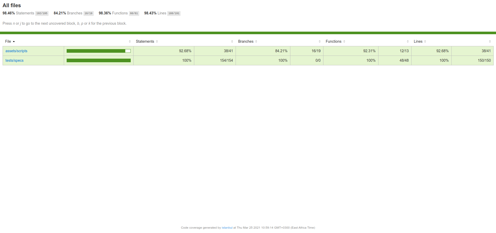

## About [](https://travis-ci.org/PeterKitonga/jasmineexampleci)

### Brief

This repo demonstrates an example setup with jasmine for unit testing and a coverage report using istanbul. The CI system in use is travis CI.

### Setup

Simply:
- Clone the repo 

```
git clone https://github.com/PeterKitonga/jasmineexampleci.git
```
- cd ```/path/to/folder```
- Install dependencies ```npm install```
- Run tests ```npm test```
- In browser visit ```http://[path to folder]/tests/html/index.html```

### Illustration for Coverage Report


### Tutorial
Visit [Udemy](https://www.udemy.com/course/unit-testing-your-javascript-with-jasmine) for the tutorial